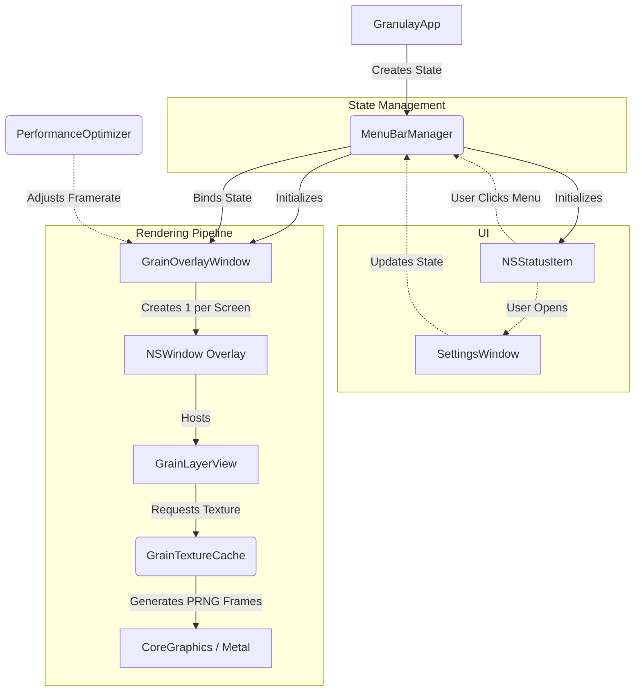

# Granulay Architecture

This document provides a high-level overview of the Granulay project architecture, explaining module responsibilities, the execution flow, and how the core rendering works.

## Project Structure

Granulay is a hybrid macOS application built using **AppKit** and **SwiftUI**. 
Crucially, **it has no main application window**. The application lives entirely in the macOS menu bar and creates transparent, borderless `NSWindow` overlays on top of the user's screens to render the grain effect.

## Execution Flow

The following diagram illustrates the startup sequence and how state flows from the user interface down to the rendering pipeline.

### 1. Entry Point
- **`GranulayApp.swift`**: The `@main` entry point. It creates the `MenuBarManager` as a `@StateObject`. It declares a `Settings` scene, but the primary UI interaction happens via the menu bar.

### 2. State & Control
- **`MenuBarManager.swift`**: The brain of the application. It acts as the single source of truth (`ObservableObject`).
  - Owns the menu bar icon (`NSStatusItem`).
  - Maintains state variables: `isGrainEnabled`, `grainIntensity`, `matteIntensity`, `isMatteModeEnabled`, `preserveBrightness`, `isGrainAnimated`.
  - Saves user preferences to `UserDefaults`.
  - Instantiates and controls the `GrainOverlayWindow`.
  - Manages the lifecycle of the Settings window.

### 3. Rendering Pipeline
- **`GrainOverlayWindow.swift`**: Manages the transparent overlays.
  - Listens for screen configuration changes (e.g., plugging in an external monitor).
  - Creates an `NSWindow` for each `NSScreen`.
  - These windows are configured to ignore mouse events (`ignoresMouseEvents = true`), have no shadow, and join all spaces (`.canJoinAllSpaces`).
  - Owns the animation loop timer that updates frames when grain is animated.
- **`GrainLayerView` (in `GrainEffect.swift`)**: A custom `NSView` backed by a Core Animation layer (`wantsLayer = true`).
  - Receives opacity and blend configuration from `MenuBarManager` state.
  - Responsible for rapidly swapping the `layer.contents` with pre-generated frames from the cache.
  - Implements "temporal jitter" (a slight randomized offset in `contentsRect`) to prevent the animation from looking repetitive.
- **`GrainTextureCache` (in `GrainEffect.swift`)**: A singleton that manages texture generation and caching.
  - Uses an LRU cache policy to store generated texture atlases per display resolution.
  - Uses `SplitMix64` (a fast PRNG) to procedurally generate the noise pixels.
  - Supports two distinct modes: **Fine Grain** (spatially correlated noise) and **Matte Grain** (haze with occasional bright sparkles).

### 4. Performance Tuning
- **`PerformanceOptimizer.swift`**: A background singleton that monitors the system's frame rate.
  - If the FPS drops, it broadcasts a `updateFrequencyChanged` notification.
  - `GrainOverlayWindow` listens to this notification and dynamically adjusts its animation interval to reduce CPU/GPU load during heavy system usage.

## Settings UI Architecture

The settings window is built in SwiftUI and organized into distinct modules to maintain clean code:

- **`SettingsView.swift`**: The root view that determines which panel to display.
- **`SettingsShellView.swift`**: Provides the structural layout (sidebar and main content area).
- **`SettingsState.swift`**: An `ObservableObject` specifically scoped to the settings window (handles navigation state, loading, etc.).
- **`SettingsPanels.swift`**: Contains the individual views for each section (`AppearanceSettingsPanel`, `BehaviorSettingsPanel`, `SupportSettingsPanel`).
- **`SettingsComponents.swift`**: Reusable UI components ensuring a consistent design system (`SettingsCard`, `SettingsToggle`, etc.).
- **`SettingsTheme.swift`**: Centralized definitions for colors, animations, and layout metrics (`SettingsLayoutMetrics`).

## Persistence

User preferences are persisted using standard `UserDefaults`. `MenuBarManager` handles loading these settings on initialization and saving them whenever a state property changes (often debounced to prevent excessive disk writes while dragging a slider).

## Inactive Features (Soft-Disabled)

- **`LoFiMusicManager.swift`**: A singleton designed to stream royalty-free Lo-Fi music via `AVFoundation` from an AWS S3 bucket.
- **Status**: **Soft-disabled**. The S3 bucket associated with the project was lost.
- **Implementation**: The class remains in the codebase but is hidden from the UI (the menu bar items and the settings panel for Lo-Fi are currently removed or commented out). 
- **To Re-enable**: The S3 bucket must be restored with public read access, and the UI hooks in `MenuBarManager.swift` and `SettingsState.swift` must be reverted to show the Lo-Fi options again.